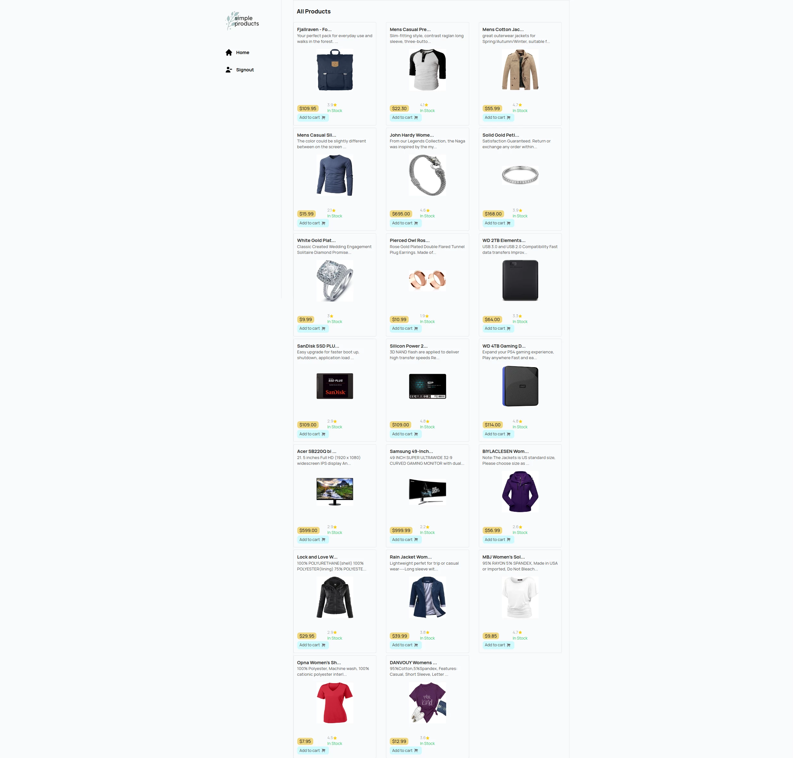
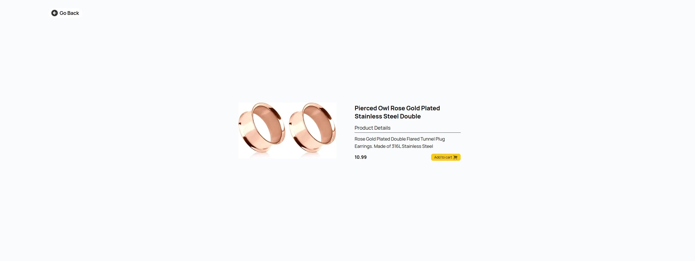

# Bonus Project for Headstarters Week 1

## Description

I chose to create a quick product page that I built using NextJS, TailwindCSS, and the fakestoreapi. The functionality is left to be done at a later date. This project is mobile responsive and dynamic, as it has some animation and when the user clicks on the product in the product page, they are navigated to that products details page by an API fetch call that dynamically inserts its productId.  

I named this project "Simple Products" due to the naming of the bonus assignment (build a product page and host it on Vercel). Simple Products can easily have authentication added to it. I have already installed the next-auth package.

## Usage

To try this project out, just click <a href='https://headstarter-project-page.vercel.app/' target='_blank' rel='noopener noreferrer'> here</a> for the deployed site.

## Contact

[email](mailto://wlowrimore@gmail.com) 
[linkedIn](https://www.linkedin.com/in/william-lowrimore-dev) 
[github](https://www.github.com/wlowrimore) 
[website](http://www.williamlowrimore.com)
